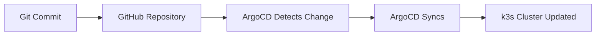

# Feanor 🔥⚒️

> _"Fëanor was the mightiest in skill of word and of hand, more learned than his brothers; his spirit burned as a flame."_

Forging and orchestrating my homelab realms with NixOS and k3s — fully GitOps-controlled via ArgoCD.

[](https://opensource.org/licenses/MIT)

---

## 📖 Overview

Feanor is a declarative, GitOps-managed homelab infrastructure built on:

- **NixOS** - Reproducible system configuration
- **k3s** - Lightweight Kubernetes distribution
- **ArgoCD** - GitOps continuous delivery
- **Helm** - Kubernetes package management

All infrastructure and applications are defined as code, versioned in Git, and automatically deployed via ArgoCD's App of Apps pattern.

---

## 🏗️ Architecture

```
┌─────────────────────────────────────────────┐
│          NixOS Base System                  │
│  • System configuration via flake.nix       │
│  • k3s installation & configuration         │
└─────────────────┬───────────────────────────┘
                  │
┌─────────────────▼───────────────────────────┐
│              k3s Cluster                    │
│  • Single-node lightweight Kubernetes       │
└─────────────────┬───────────────────────────┘
                  │
┌─────────────────▼───────────────────────────┐
│           ArgoCD (GitOps)                   │
│  • App of Apps pattern                      │
│  • Automatic sync from Git                  │
└─────────────────┬───────────────────────────┘
                  │
        ┌─────────┴──────────┐
        │                    │
┌───────▼─────┐    ┌────────▼────────┐
│Infrastructure│    │  Applications   │
│   Services   │    │                 │
├──────────────┤    ├─────────────────┤
│• cert-manager│    │ • Authentik     │
│• postgres-op │    │ • Forgejo       │
│              │    │ • Jellyfin      │
│              │    │ • Home Assistant│
│              │    │ • Glance        │
└──────────────┘    └─────────────────┘
```

---

## 📂 Repository Structure

```
.
├── flake.nix                          # Nix flake for system configuration
├── flake.lock                         # Locked dependency versions
├── nixos/
│   └── configuration.nix              # NixOS system configuration
└── gitops/
    ├── root-app-of-apps.yaml         # ArgoCD root application
    └── apps/                          # Application definitions
        ├── authentik/                 # Identity provider
        ├── cert-manager/              # TLS certificate management
        ├── forgejo/                   # Self-hosted Git service
        ├── forgejo-runner/            # CI/CD runners
        ├── glance/                    # Dashboard
        ├── home-assistant/            # Home automation
        ├── jellyfin/                  # Media server
        └── postgres-operator/         # PostgreSQL operator
```

---

## 🚀 Deployed Applications

### Infrastructure Services

| Service               | Description                                             | Status      |
| --------------------- | ------------------------------------------------------- | ----------- |
| **cert-manager**      | Automated TLS certificate management with Let's Encrypt | ✅ Deployed |
| **postgres-operator** | PostgreSQL operator for managed databases               | ✅ Deployed |

### Applications

| Application        | Description                                  | Status      |
| ------------------ | -------------------------------------------- | ----------- |
| **Authentik**      | Open-source Identity Provider (SSO/OAuth2)   | ✅ Deployed |
| **Forgejo**        | Self-hosted Git service (GitHub alternative) | ✅ Deployed |
| **Forgejo Runner** | CI/CD runners for Forgejo Actions            | ✅ Deployed |
| **Jellyfin**       | Open-source media server                     | ✅ Deployed |
| **Home Assistant** | Home automation platform                     | ✅ Deployed |
| **Glance**         | Personal dashboard                           | ✅ Deployed |

---

## 🛠️ Getting Started

### Prerequisites

- NixOS system
- Basic understanding of Nix, Kubernetes, and GitOps concepts
- Access to the host machine

### Initial Setup

1. **Clone the repository:**

   ```bash
   git clone https://github.com/Pixelinator/Feanor.git
   cd Feanor
   ```

2. **Apply NixOS configuration:**

   ```bash
   sudo nixos-rebuild switch --flake .#
   ```

3. **Verify k3s is running:**

   ```bash
   sudo k3s kubectl get nodes
   ```

4. **Install ArgoCD:**

   ```bash
   sudo k3s kubectl create namespace argocd
   sudo k3s kubectl apply -n argocd -f https://raw.githubusercontent.com/argoproj/argo-cd/stable/manifests/install.yaml
   ```

5. **Deploy the App of Apps:**

   ```bash
   sudo k3s kubectl apply -f gitops/root-app-of-apps.yaml
   ```

6. **Access ArgoCD UI:**

   ```bash
   # Get initial admin password
   sudo k3s kubectl -n argocd get secret argocd-initial-admin-secret -o jsonpath="{.data.password}" | base64 -d

   # Port forward to access UI
   sudo k3s kubectl port-forward svc/argocd-server -n argocd 8080:443
   ```

   Navigate to `https://localhost:8080` and login with username `admin`.

---

## 🔐 Security Considerations

- **Secrets Management:** Sealed Secrets are used for sensitive data (e.g., Porkbun API credentials in cert-manager)
- **TLS Certificates:** Automated via cert-manager with Let's Encrypt (staging and production issuers)
- **Authentication:** Authentik provides centralized SSO/OAuth2 for applications
- **Network Policies:** Configure according to your security requirements

---

## 🔄 GitOps Workflow

All changes to infrastructure and applications follow this workflow:

1. **Modify configuration** in this Git repository
2. **Commit and push** changes to the main branch
3. **ArgoCD automatically syncs** changes to the cluster
4. **Monitor deployment** status in ArgoCD UI



---

## 📝 Adding New Applications

To add a new application:

1. **Create application directory:**

   ```bash
   mkdir -p gitops/apps/my-app
   ```

2. **Create Helm chart structure:**

   ```bash
   cd gitops/apps/my-app
   cat > Chart.yaml <<EOF
   apiVersion: v2
   name: my-app
   version: 1.0.0
   dependencies:
     - name: upstream-chart
       version: "x.x.x"
       repository: https://charts.example.com
   EOF

   cat > values.yaml <<EOF
   # Your custom values here
   EOF
   ```

3. **Add templates if needed:**

   ```bash
   mkdir templates
   # Add custom Kubernetes manifests
   ```

4. **Create ArgoCD Application:**
   Add entry to `root-app-of-apps.yaml` or create a separate Application manifest.

5. **Commit and push:**
   ```bash
   git add gitops/apps/my-app
   git commit -m "Add my-app"
   git push
   ```

ArgoCD will automatically detect and deploy the new application.

---

## 🔧 Maintenance

### Updating Applications

Applications are updated by modifying their respective Helm chart versions or values:

```bash
# Edit the Chart.yaml or values.yaml
vim gitops/apps/jellyfin/values.yaml

# Commit and push
git add gitops/apps/jellyfin/values.yaml
git commit -m "Update Jellyfin configuration"
git push
```

### Viewing Logs

```bash
# View pod logs
sudo k3s kubectl logs -n <namespace> <pod-name>

# View ArgoCD application status
sudo k3s kubectl get applications -n argocd
```

### Manual Sync

If automatic sync is disabled or you want to force a sync:

```bash
# Via CLI
argocd app sync <app-name>

# Or use ArgoCD UI
```

---

## 🐛 Troubleshooting

### ArgoCD app shows "OutOfSync"

Check the ArgoCD UI for detailed diff and error messages. Common causes:

- Kubernetes API version incompatibility
- Resource conflicts
- Invalid YAML syntax

### Pod stuck in "Pending" state

```bash
sudo k3s kubectl describe pod -n <namespace> <pod-name>
```

Common issues:

- Insufficient resources
- PVC not bound
- Image pull errors

### Certificate issues

```bash
# Check cert-manager logs
sudo k3s kubectl logs -n cert-manager deployment/cert-manager

# Check certificate status
sudo k3s kubectl get certificate -A
```

---

## 📚 Resources

- [NixOS Manual](https://nixos.org/manual/nixos/stable/)
- [k3s Documentation](https://docs.k3s.io/)
- [ArgoCD Documentation](https://argo-cd.readthedocs.io/)
- [Helm Documentation](https://helm.sh/docs/)

---

## 🤝 Contributing

This is a personal homelab project, but suggestions and improvements are welcome! Feel free to:

- Open issues for bugs or feature requests
- Submit pull requests
- Share your own homelab setups inspired by this one

---

## 📄 License

This project is licensed under the MIT License - see the [LICENSE](LICENSE) file for details.

---

## 🙏 Acknowledgments

- The NixOS community for the amazing declarative system
- ArgoCD team for excellent GitOps tooling
- All open-source projects deployed in this homelab

---

**Note:** This is a personal homelab environment. Configuration details like domain names, API keys, and other sensitive information have been kept generic or are managed via Sealed Secrets.
