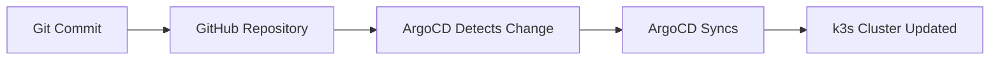

# Feanor 🔥⚒️

> _"Fëanor was the mightiest in skill of word and of hand, more learned than his brothers; his spirit burned as a flame."_

Forging and orchestrating my homelab realms with NixOS and k3s — fully GitOps-controlled via ArgoCD.

[](https://opensource.org/licenses/MIT)

---

## 📖 Overview

Feanor is a declarative, GitOps-managed homelab infrastructure built on:

- **NixOS** - Reproducible system configuration
- **deploy-rs** - Atomic remote NixOS deployments with automatic rollback
- **k3s** - Lightweight Kubernetes distribution
- **ArgoCD** - GitOps continuous delivery
- **Helm** - Kubernetes package management

All infrastructure and applications are defined as code, versioned in Git, and automatically deployed via ArgoCD's App of Apps pattern.

---

## 🏗️ Architecture

```
┌─────────────────────────────────────────────┐
│          NixOS Base System                  │
│  • System configuration via flake.nix       │
│  • k3s installation & configuration         │
└─────────────────┬───────────────────────────┘
                  │
┌─────────────────▼───────────────────────────┐
│              k3s Cluster                    │
│  • Single-node lightweight Kubernetes       │
└─────────────────┬───────────────────────────┘
                  │
┌─────────────────▼───────────────────────────┐
│           ArgoCD (GitOps)                   │
│  • App of Apps pattern                      │
│  • Automatic sync from Git                  │
└─────────────────┬───────────────────────────┘
                  │
        ┌─────────┴──────────┐
        │                    │
┌───────▼─────┐    ┌────────▼────────┐
│Infrastructure│    │  Applications   │
│   Services   │    │                 │
├──────────────┤    ├─────────────────┤
│• cert-manager│    │ • Authentik     │
│• postgres-op │    │ • Forgejo       │
│              │    │ • Jellyfin      │
│              │    │ • Home Assistant│
│              │    │ • Glance        │
│              │    │ • Paperless-ngx │
│              │    │ • Vaultwarden   │
└──────────────┘    └─────────────────┘
```

---

## 📂 Repository Structure

```
.
├── host.nix                           # ✏️  YOUR machine: hostname, IP, username, SSH key
├── host.example.nix                   # Template — copy to host.nix and fill in your values
├── nixos/
│   ├── hardware.nix                   # ✏️  YOUR hardware: disks, boot loader, kernel modules
│   └── configuration.nix              # Generic NixOS config (no machine-specific values)
├── flake.nix                          # Nix flake — wires host.nix, NixOS, and deploy-rs
├── flake.lock                         # Locked dependency versions
└── gitops/
    ├── root-app-of-apps.yaml          # ArgoCD root application
    └── apps/                          # Application definitions
        ├── argocd/                    # ArgoCD (self-managed)
        ├── authentik/                 # Identity provider
        ├── cert-manager/              # TLS certificate management
        ├── forgejo/                   # Self-hosted Git service
        ├── forgejo-runner/            # CI/CD runners
        ├── glance/                    # Dashboard
        ├── home-assistant/            # Home automation
        ├── jellyfin/                  # Media server
        ├── paperless-ngx/             # Document management
        ├── postgres-operator/         # PostgreSQL operator
        └── vaultwarden/               # Password manager
```

The ✏️ files are the only ones you need to change to adapt this repo to your own machine.

---

## 🚀 Deployed Applications

### Infrastructure Services

| Service               | Description                                             | Status      |
| --------------------- | ------------------------------------------------------- | ----------- |
| **ArgoCD**            | GitOps continuous delivery (self-managed)               | ✅ Deployed |
| **cert-manager**      | Automated TLS certificate management with Let's Encrypt | ✅ Deployed |
| **postgres-operator** | PostgreSQL operator for managed databases               | ✅ Deployed |

### Applications

| Application        | Description                                  | Status      |
| ------------------ | -------------------------------------------- | ----------- |
| **Authentik**      | Open-source Identity Provider (SSO/OAuth2)   | ✅ Deployed |
| **Forgejo**        | Self-hosted Git service (GitHub alternative) | ✅ Deployed |
| **Forgejo Runner** | CI/CD runners for Forgejo Actions            | ✅ Deployed |
| **Jellyfin**       | Open-source media server                     | ✅ Deployed |
| **Home Assistant** | Home automation platform                     | ✅ Deployed |
| **Glance**         | Personal dashboard                           | ✅ Deployed |
| **Paperless-ngx**  | Document management and archiving            | ✅ Deployed |
| **Vaultwarden**    | Self-hosted Bitwarden-compatible password manager | ✅ Deployed |

---

## 🛠️ Getting Started

### Prerequisites

- A machine running (or being installed with) NixOS
- Nix with flakes enabled on the machine you deploy **from**
- An SSH key pair — deploy-rs authenticates with your public key, no password needed

### 1. Configure your machine

Copy the example host config and fill in your values:

```bash
cp host.example.nix host.nix
$EDITOR host.nix
```

Then replace `nixos/hardware.nix` with your machine's hardware config. The easiest way is to boot a NixOS installer and run:

```bash
nixos-generate-config --no-filesystems
```

Copy the output into `nixos/hardware.nix` and add your `fileSystems` entries manually.

### 2. Initial NixOS installation

On first install, apply the config locally from the target machine:

```bash
sudo nixos-rebuild switch --flake .#
```

Make sure your SSH public key is in `host.nix` before this step — deploy-rs needs it for all subsequent deployments.

### 3. Deploy remotely with deploy-rs

After the initial install, all future deployments run from your local machine:

```bash
deploy .#
```

deploy-rs SSHs into the machine, builds the new system (on the remote), and activates it. If the machine stops responding within the health-check window, it automatically rolls back to the previous generation.

### 4. Bootstrap ArgoCD

Once NixOS is running and k3s is up:

```bash
# Verify k3s is running
sudo k3s kubectl get nodes

# Install ArgoCD
sudo k3s kubectl create namespace argocd
sudo k3s kubectl apply -n argocd -f https://raw.githubusercontent.com/argoproj/argo-cd/stable/manifests/install.yaml

# Deploy the App of Apps (ArgoCD takes it from here)
sudo k3s kubectl apply -f gitops/root-app-of-apps.yaml
```

### 5. Access ArgoCD UI

```bash
# Get initial admin password
sudo k3s kubectl -n argocd get secret argocd-initial-admin-secret -o jsonpath="{.data.password}" | base64 -d

# Port forward to access UI
sudo k3s kubectl port-forward svc/argocd-server -n argocd 8080:443
```

Navigate to `https://localhost:8080` and log in with username `admin`.

---

## 🔐 Security Considerations

- **Secrets Management:** Sealed Secrets are used for sensitive data (e.g., Porkbun API credentials in cert-manager)
- **TLS Certificates:** Automated via cert-manager with Let's Encrypt (staging and production issuers)
- **Authentication:** Authentik provides centralized SSO/OAuth2 for applications
- **No plain secrets in repo:** `host.nix` contains only non-sensitive metadata (hostname, IP, username, public SSH key). All secrets are encrypted with `kubeseal`.

---

## 🔄 GitOps Workflow

NixOS changes (OS config, packages):

```
Edit nixos/ or host.nix  →  deploy .#  →  machine updated atomically
```

Kubernetes app changes:

```
Edit gitops/apps/*  →  git push  →  ArgoCD auto-syncs  →  cluster updated
```


```mermaid
graph LR
    A[Git Commit] --> B[GitHub Repository]
    B --> C[ArgoCD Detects Change]
    C --> D[ArgoCD Syncs]
    D --> E[k3s Cluster Updated]
```

---

## 📝 Adding New Applications

1. Create `gitops/apps/<app-name>/` — the directory name becomes the ArgoCD app name and namespace.

2. Choose a pattern:
   - **Helm wrapper:** `Chart.yaml` (upstream dependency) + `values.yaml`
   - **Plain YAML:** single manifest file with all resources

3. Commit and push — ArgoCD detects the new directory and deploys automatically.

See `gitops/apps/authentik/` for a Helm wrapper example with a managed Postgres database.

---

## 🔧 Maintenance

### Updating the NixOS system

```bash
# Update flake inputs (bumps nixpkgs, deploy-rs, etc.)
nix flake update

# Deploy the updated system
deploy .#
```

### Updating Kubernetes applications

```bash
# Edit the chart version or values
$EDITOR gitops/apps/jellyfin/values.yaml

git commit -am "Update Jellyfin configuration"
git push
# ArgoCD picks it up automatically
```

### Viewing logs

```bash
sudo k3s kubectl logs -n <namespace> <pod-name>
sudo k3s kubectl get applications -n argocd
```

### Manual ArgoCD sync

```bash
argocd app sync <app-name>
```

---

## 🐛 Troubleshooting

### ArgoCD app shows "OutOfSync"

Check the ArgoCD UI for the detailed diff. Common causes: Kubernetes API version mismatch, resource conflicts, invalid YAML.

### Pod stuck in "Pending"

```bash
sudo k3s kubectl describe pod -n <namespace> <pod-name>
```

Common causes: insufficient resources, PVC not bound, image pull errors.

### Certificate issues

```bash
sudo k3s kubectl logs -n cert-manager deployment/cert-manager
sudo k3s kubectl get certificate -A
```

### deploy-rs rollback triggered

deploy-rs rolls back automatically if the machine stops responding after activation. Check `journalctl -xe` on the machine for the activation failure reason.

---

## 📚 Resources

- [NixOS Manual](https://nixos.org/manual/nixos/stable/)
- [deploy-rs Documentation](https://github.com/serokell/deploy-rs)
- [k3s Documentation](https://docs.k3s.io/)
- [ArgoCD Documentation](https://argo-cd.readthedocs.io/)
- [Helm Documentation](https://helm.sh/docs/)

---

## 🤝 Contributing

This is a personal homelab project, but suggestions and improvements are welcome! Feel free to open issues, submit pull requests, or fork it as a starting point for your own homelab.

---

## 📄 License

This project is licensed under the MIT License — see the [LICENSE](LICENSE) file for details.
